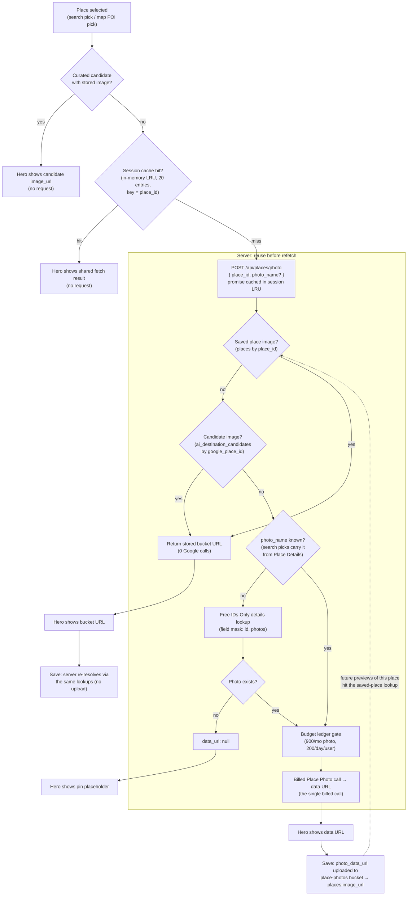

# Place Photo Strategy — Add Place Modal

Strategies behind fetching, previewing, and storing place photos when adding a
place (map POI pick or search pick), optimized for minimal Google Places API
billing.

## 1. One billed call per place, ever

The photo is fetched from Google once at preview time as a data URL, shown in
the modal hero, and the same bytes are sent back on save and uploaded to our
own Supabase Storage bucket (`place-photos`). Viewing saved places never calls
Google again. Proof that Place Photos is a billed SKU with its own (small) free
tier: [Places API pricing](https://developers.google.com/maps/billing-and-pricing/pricing).

## 2. Field-mask discipline: stay in the free tier

Place Details requests are billed by the most expensive field in the field
mask. Our map-POI photo lookup masks only `id,photos` — both **Essentials IDs
Only** fields, so the reference lookup costs $0. Adding any Pro field (e.g.
`displayName`) would flip the whole request to ~$17/1,000.

| SKU tier            | Example fields                                | Cost         |
| ------------------- | --------------------------------------------- | ------------ |
| Essentials IDs Only | `id`, `name`*, `photos`, `attributions`       | $0           |
| Essentials          | `location`, `formattedAddress`, `types`       | ~$5 / 1,000  |
| Pro                 | `displayName`, `googleMapsUri`, `primaryType` | ~$17 / 1,000 |

*`name` is the resource name (`places/ChIJ…`), not the human-readable title.

Proof: [SKU details & field lists](https://developers.google.com/maps/billing-and-pricing/sku-details),
[Place Details field masks](https://developers.google.com/maps/documentation/places/web-service/place-details).

## 3. Reuse before refetch (server-side)

Before billing Google, the photo endpoint checks images we already own for the
same Google place id: first any saved place's stored photo (`places` table),
then the curated candidate catalog (`ai_destination_candidates`). A hit returns
our bucket URL — zero Google calls, across all users, sessions, and devices.
No dedicated cache table: the saved-places lookup misses only places that were
previewed but never saved, or whose saved copy was deleted.

## 4. Client session cache (in-memory + LRU)

A module-level promise `Map` keyed by place id dedupes repeated and concurrent
previews of the same place within one page session (e.g. clicking "Add this
place" on the same POI repeatedly). Capped at 20 entries with least-recently-
used eviction (~50–150KB per photo); rejected fetches are evicted so errors
stay retryable. See `src/lib/place-photo-session-cache.ts`.

- Not React state: state dies with the modal; the cache must survive
  close/reopen.
- Not `localStorage`/IndexedDB: ~5MB quota shared with the route-geometry
  cache, and Google's policy forbids caching Places content client-side beyond
  short windows — only place IDs may be stored indefinitely. Server-side reuse
  (#3) strictly dominates it anyway. Proof:
  [Places API policies (caching & place ID exception)](https://developers.google.com/maps/documentation/places/web-service/policies).

The full resolution path, combining #1–#4:

## 5. Budget ledger as a hard backstop

Every billed call is recorded in `google_places_api_calls` and gated by
internal ceilings kept under Google's free tiers: 900/month photo, 4,500/month
details, 9,000/month autocomplete, 200/day per user. A burst can never spill
into paid usage.

## 6. POI name via DOM, not the API

Map POI clicks read the place name from Google's native info window DOM
(free); `displayName` via the API is a Pro-tier field (~$17/1,000). If the
scrape fails, the modal asks the user to type the name.
